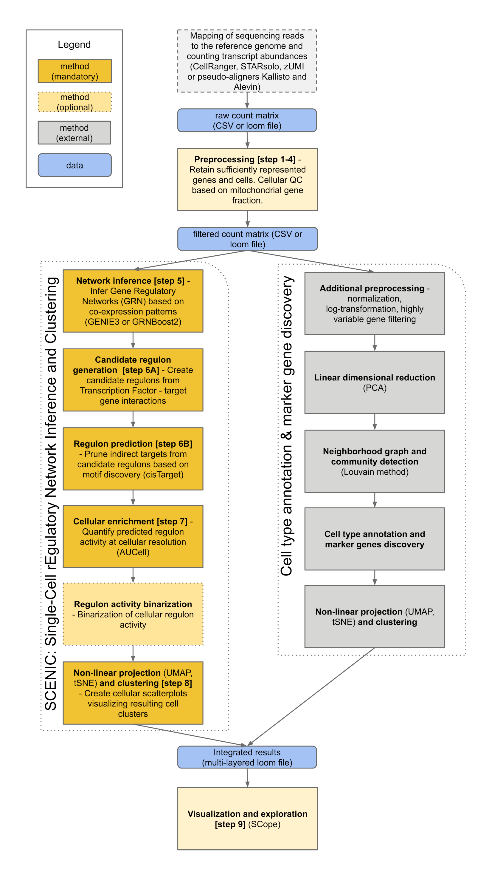

# A scalable SCENIC workflow for single-cell gene regulatory network analysis

This repository describes how to run a pySCENIC gene regulatory network inference analysis alongside a basic "best practices" expression analysis for single-cell data.
This includes:
* Standalone Jupyter notebooks for an interactive analysis
* A Nextflow DSL1 workflow, which provides a semi-automated and streamlined method for running these steps
* Details on pySCENIC installation, usage, and downstream analysis

See also the associated publication in **Nature Protocols**: https://doi.org/10.1038/s41596-020-0336-2.

For an advanced implementation of the steps in this protocol, see **[VSN Pipelines](https://github.com/vib-singlecell-nf/vsn-pipelines)**, a Nextflow DSL2 implementation of pySCENIC with comprehensive and customizable pipelines for expression analysis.
This includes additional pySCENIC features (multi-runs, integrated motif- and track-based regulon pruning, loom file generation).

## Overview

* [Quick start](#quick-start)
* [Requirements](#general-requirements-for-this-workflow)
* [Installation](docs/installation.md)
* Case studies
  * PBMC 10k dataset (10x Genomics)
    * Full SCENIC analysis, plus filtering, clustering, visualization, and SCope-ready loom file creation:
      * [Jupyter notebook](notebooks/PBMC10k_SCENIC-protocol-CLI.ipynb) 
        | 
        [HTML render](http://htmlpreview.github.io/?https://github.com/aertslab/SCENICprotocol/blob/master/notebooks/PBMC10k_SCENIC-protocol-CLI.html)
    * Extended analysis post-SCENIC:
      * [Jupyter notebook](notebooks/PBMC10k_downstream-analysis.ipynb)
        | 
        [HTML render](http://htmlpreview.github.io/?https://github.com/aertslab/SCENICprotocol/blob/master/notebooks/PBMC10k_downstream-analysis.html)
    * To run the same dataset through the VSN Pipelines DSL2 workflow, see [this tutorial](https://vsn-pipelines-examples.readthedocs.io/en/latest/PBMC10k.html).
  * Cancer data sets
    * [Jupyter notebook](notebooks/SCENIC%20Protocol%20-%20Case%20study%20-%20Cancer%20data%20sets.ipynb)
        | 
        [HTML render](http://htmlpreview.github.io/?https://github.com/aertslab/SCENICprotocol/blob/master/notebooks/SCENIC%20Protocol%20-%20Case%20study%20-%20Cancer%20data%20sets.html)
  * Mouse brain data set
    * [Jupyter notebook](notebooks/SCENIC%20Protocol%20-%20Case%20study%20-%20Mouse%20brain%20data%20set.ipynb)
        | 
        [HTML render](http://htmlpreview.github.io/?https://github.com/aertslab/SCENICprotocol/blob/master/notebooks/SCENIC%20Protocol%20-%20Case%20study%20-%20Mouse%20brain%20data%20set.html)
* [References and more information](#references-and-more-information)

---
## Quick start

### Running the pySCENIC pipeline in a Jupyter notebook
We recommend using 
    [this notebook](notebooks/PBMC10k_SCENIC-protocol-CLI.ipynb) 
    as a template for running an interactive analysis in Jupyter.
See the 
    [installation instructions](docs/installation.md)
    for information on setting up a kernel with pySCENIC and other required packages.

### Running the Nextflow pipeline on the example dataset

#### Requirements (Nextflow/containers)

The following tools are required to run the steps in this Nextflow pipeline:
* [Nextflow](https://www.nextflow.io/)
* A container system, either of:
    * [Docker](https://docs.docker.com/)
    * [Singularity](https://www.sylabs.io/singularity/)

The following container images will be pulled by nextflow as needed:
* Docker: [aertslab/pyscenic:latest](https://hub.docker.com/r/aertslab/pyscenic).
* Singularity: [aertslab/pySCENIC:latest](https://www.singularity-hub.org/collections/2033).
* [See also here.](https://github.com/aertslab/pySCENIC#docker-and-singularity-images)

#### Using the test profile

A quick test can be accomplished using the `test` profile, which automatically pulls the testing dataset (described in full below):

    nextflow run aertslab/SCENICprotocol \
        -profile docker,test

This small test dataset takes approximately 70s to run using 6 threads on a standard desktop computer.

#### Download testing dataset

Alternately, the same data can be run with a more verbose approach (this is more illustrative for how to substitute other data into the pipeline).
Download a minimum set of SCENIC database files for a human dataset (approximately 78 MB).

    mkdir example && cd example/
    # Transcription factors:
    wget https://raw.githubusercontent.com/aertslab/SCENICprotocol/master/example/test_TFs_tiny.txt
    # Motif to TF annotation database:
    wget https://raw.githubusercontent.com/aertslab/SCENICprotocol/master/example/motifs.tbl
    # Ranking databases:
    wget https://raw.githubusercontent.com/aertslab/SCENICprotocol/master/example/genome-ranking.feather
    # Finally, get a tiny sample expression matrix (loom format):
    wget https://raw.githubusercontent.com/aertslab/SCENICprotocol/master/example/expr_mat_tiny.loom

#### Running the example pipeline

Either Docker or Singularity images can be used by specifying the appropriate profile (`-profile docker` or `-profile singularity`).
Please note that for the tiny test dataset to run successfully, the default thresholds need to be lowered.

##### Using loom input

    nextflow run aertslab/SCENICprotocol \
        -profile docker \
        --loom_input expr_mat_tiny.loom \
        --loom_output pyscenic_integrated-output.loom \
        --TFs test_TFs_tiny.txt \
        --motifs motifs.tbl \
        --db *feather \
        --thr_min_genes 1

By default, this pipeline uses the container specified by the `--pyscenic_container` parameter.
This is currently set to `aertslab/pyscenic:0.9.19`, which uses a container with both pySCENIC and Scanpy `1.4.4.post1` installed.
A custom container can be used (e.g. one built on a local machine) by passing the name of this container to the `--pyscenic_container` parameter.

##### Expected output

The output of this pipeline is a loom-formatted file (by default: `output/pyscenic_integrated-output.loom`) containing:
* The original expression matrix
* The pySCENIC-specific results:
    * Regulons (TFs and their target genes)
    * AUCell matrix (cell enrichment scores for each regulon)
    * Dimensionality reduction embeddings based on the AUCell matrix (t-SNE, UMAP)
*  Results from the parallel best-practices analysis using highly variable genes:
    * Dimensionality reduction embeddings (t-SNE, UMAP)
    * Louvain clustering annotations

## General requirements for this workflow
* Python version 3.6 or greater
* Tested on various Unix/Linux distributions (Ubuntu 18.04, CentOS 7.6.1810, MacOS 10.14.5)

---

## References and more information

### SCENIC
* [SCENIC (R) on GitHub](https://github.com/aertslab/SCENIC)
* [SCENIC website](http://scenic.aertslab.org/)
* [SCENIC publication](https://doi.org/10.1016/j.cell.2018.05.057)
* [pySCENIC on GitHub](https://github.com/aertslab/pySCENIC)
* [pySCENIC documentation](https://pyscenic.readthedocs.io/en/latest/)
* [VSN Pipelines](https://github.com/vib-singlecell-nf/vsn-pipelines), a repository of pipelines for single-cell data in Nextflow DSL2, including an implementation of pySCENIC.

### SCope
* [SCope webserver](http://scope.aertslab.org/)
* [SCope on GitHub](https://github.com/aertslab/SCope)
* [SCopeLoomR](https://github.com/aertslab/SCopeLoomR)
* [SCopeLoomPy](https://github.com/aertslab/SCopeLoomPy)

### Scanpy
* [Scanpy on GitHub](https://github.com/theislab/scanpy)
* [Scanpy documentation](https://scanpy.readthedocs.io/)
* [Scanpy publication](https://doi.org/10.1186/s13059-017-1382-0)

